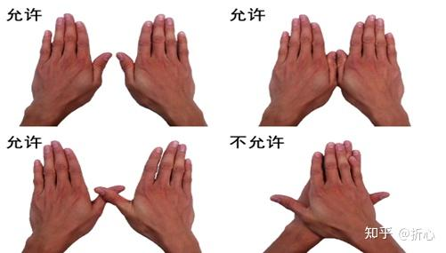

# 转身，到边技术说明

## 蝶泳转身，到边技术检查

### 1.两只手同时到边

在每次转身和到达终点时，两手应分开在**水面**、**水上**或**水下同时**触壁。

## 仰泳转身，到边技术说明

### 1.标准的转身

转身时，运动员必须用身体的某部分触壁。

转身过程中，肩可以转过垂直面至俯卧姿势，此后立即做**一次**连续的**单臂划水**或**双臂划水**动作，并以此动作开始转身。

运动员必须呈**仰卧姿式**蹬离池壁。

### 2.特殊情况说明

考虑到大部分同学游泳水平较低，允许使用蝶泳，蛙泳转身技术。

👀️**注意：** 运动员必须呈**仰卧姿式**蹬离池壁。

## 蛙泳转身，到边技术说明

### 1.俯卧转身

出发和每次转身后从第一次手臂动作开始，身体应保持**俯卧**姿势，除转身动作外，任何时候都不允许转成仰卧姿势。

转身时允许 运动员在触壁后用任何方式转身，只要身体呈**俯卧姿势**蹬离池壁即可。

从出发开始到整个游程中，动作周期必须是以一次划臂和一次蹬腿的顺序完成。两臂的所有动作应同时进行，**不得有交替动作**。 

### 其他转身，到边要求

在每次转身和到达终点时，两手应分开在水面、水上或水下**同时触壁**。

转身和到达终点前的最后一次手臂动作后可不接蹬腿动作。

在触壁前的最后一次划水动作结束后，头可以没入水中。但在触壁前 的最后一个完整或不完整动作周期中，头的一部分必须露出水面。

## 自由泳转身，到边技术说明

每次转身和到达终点时，运动员身体的**某一部分必**须触及池壁。

[<<回首页](README.md)